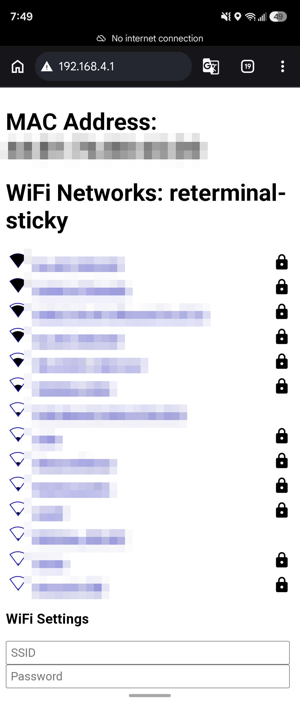

# reTerminal Sticky — Voice Companion

An ESPHome firmware that turns the Seeed reTerminal Sticky into a
battery-aware **Home Assistant voice satellite with an 8-page touch e-ink
UI** — grown from Seeed's official Sticky ESPHome hardware example into a
device three of which run a real household around the clock.

Speak to your assistant, read the full reply as ink, flip through your
shopping list, agenda, weather, lights, and timers — and leave one shared
household note that every Sticky in the house announces and mirrors.

## Features

- **Voice assistant satellite** — OK-button push-to-talk via Home
  Assistant's Assist pipeline; works with any conversation agent you have
  configured.
- **Ink follow-ups** — the Sticky has no speaker, so the firmware exposes a
  `show_followup` action your automations (or an LLM agent) can call to
  write the *full* final answer onto the display, bypassing the voice
  pipeline's text limits.
- **8 touch pages** — Main (clock, weather, note, temps), Notes, Shopping
  list with tap-to-check-off, Today's agenda, 3-day forecast, a Lights page
  (six rooms, tap a light to toggle it or a room name for all), live Timers,
  and the Household Board.
- **Household Board** — hold OK on the board page, dictate a note, and every
  Sticky in the house beeps once, flips to the board, and shows it until
  someone taps the ✕. A fridge note that teleports.
- **Timers you can trust** — voice timers render as a live countdown, ring a
  triple-beep alarm on the device that set them, and hold the device awake
  so deep sleep can never kill a running countdown.
- **Serious battery life** — deep sleep with a 15-minute sensor heartbeat:
  the device wakes, reports battery/temperature/humidity, catches up on the
  board, and naps again in ~75 seconds. Button and touch wakes get a
  3-minute interaction grace instead. The e-ink never repaints just because
  the device woke — paints happen on events and a ~30-minute clock cadence.
- **Fleet-ready** — one base yaml; each additional unit is a five-line
  wrapper file (see `unit-two.example.yaml`) with its own name and watermark
  art. A shared `input_boolean` pins the whole fleet awake for OTA sessions.
- **First-boot provisioning** — the prebuilt image raises a `reTerminal-Sticky`
  Wi-Fi hotspot with a captive portal, and supports Improv over USB serial,
  so a freshly flashed device can join your network without editing yaml.

## Hardware notes this firmware carries

Two fixes worth knowing about even if you never flash this firmware:

1. **PDM microphone dies after deep-sleep wake.** On wake, the ESP32-S3 pin
   mux hands GPIO19/20 back to the USB-Serial-JTAG peripheral, and the PDM
   microphone goes silent — every post-wake voice attempt returns
   "no text recognized". `include/usb_jtag_release.h` detaches the pins
   early in boot and clean-cycles the mic power rail (GPIO38) so the mic
   comes back reliably. See `esphome: on_boot` priority 800.
2. **BQ27220 fuel gauge readings.** Battery percentage, voltage (mV), and
   current (mA) are read directly from the gauge's registers (0x2C, 0x08,
   0x0C) over I²C — see the three template sensors. Negative current =
   discharging.

Also encoded in the config, learned the hard way:

- The GT911 touch panel reports a **mirrored y-axis** relative to the
  portrait layout — every tap hit-test uses `800 - touch.y`.
- Voice-assistant timer events deliver a **single `timer`** object per
  event; the firmware maintains a ledger string and prunes stale entries so
  a cancelled timer can never wedge the sleep gate.
- Deep sleep would silently kill running on-device timers, so the sleep
  script refuses to sleep while the timer ledger is non-empty — and retries
  with pruning instead of giving up, so it can't wedge either.

## What you need

- A Seeed reTerminal Sticky (tested on three production units)
- Home Assistant with the ESPHome integration and an Assist pipeline
- ESPHome 2026.7 or newer to compile (`pip install esphome` or `uvx esphome`)

## Setup

0. **Flashing from the Playground?** After the flash, the device raises a
   `reTerminal-Sticky` hotspot — join it and the captive portal walks you
   through Wi-Fi (networks blurred here for the neighbors' privacy):

   

1. **Home Assistant helpers first:** merge `homeassistant.example.yaml` into
   your configuration — three small bridge sensors (shopping list, agenda,
   forecast), the board/note helpers, and the stay-awake toggle. Check
   config and restart once.
2. **Secrets:** copy `secrets.example.yaml` to `secrets.yaml` and fill in
   Wi-Fi credentials and an OTA password.
3. **Substitutions:** open `sticky-voice-companion.yaml` and point the
   substitutions block at *your* entities — the lights for your six rooms,
   your weather entity, your calendars (in the HA bridge), and the name your
   assistant goes by.
4. **Compile and flash:** `esphome run sticky-voice-companion.yaml` with the
   device on USB for the first flash; every update after that is OTA.
5. **Adopt in Home Assistant**, set the Assist pipeline for the satellite,
   and enable **"Allow the device to perform Home Assistant actions"** in
   the ESPHome device options — the shopping check-off, lights page, and
   board all use service calls.
6. **Watermark art (optional):** replace `art/placeholder_etch.png` with any
   480×800 1-bit PNG — a light dotted etch of your own art sits behind the
   main page and text writes right over it.

## Fleet

Each extra unit is a wrapper file:

```yaml
substitutions:
  device_name: sticky-two
  friendly_name: "Sticky Two"
  unit_label: "Sticky Two"
  etch_image: "art/my_other_art.png"

packages:
  base: !include sticky-voice-companion.yaml
```

Flash it the same way; the unit announces itself by name, joins the board
mirror automatically, and the optional fleet-health template in
`homeassistant.example.yaml` gives every unit a "last check-in" heartbeat —
a healthy Sticky proves itself twice an hour, so "quiet for two hours"
genuinely means a dead battery or dropped Wi-Fi, and an automation can page
your phone about it.

## Power behavior at a glance

| State | What happens |
|---|---|
| Timer wake (every 15 min) | report sensors, sync board, sleep in ~75 s |
| Button/touch wake | 3-minute grace, extended by interaction |
| Voice session | never sleeps mid-conversation |
| Running timer | held awake until it rings |
| `sticky_stay_awake` ON | pinned awake (OTA sessions) |
| Screen | paints on events + ~30-min clock cadence, never on bare wakes |

## Credits

Built on Seeed Studio's official reTerminal Sticky ESPHome hardware example.
Everything on top — the page system, sleep architecture, board, timers, and
the fixes above — grew out of daily household use. MIT licensed, same as the
base.
